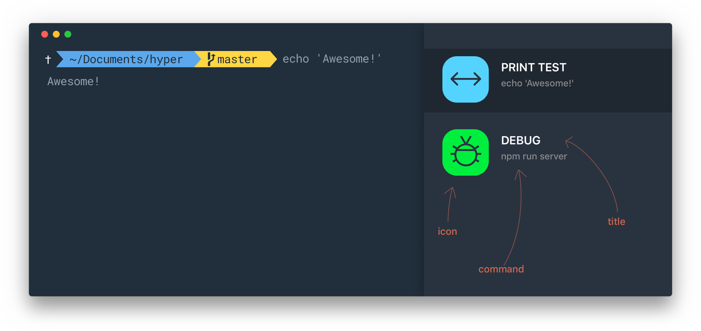

# Hyper Quick SSH
> Plugin to show a Quick List of your favorites SSH or others shell commands in Hyper

Simple to use: `Ctrl + O` or `(⌘ + O ` on mac) to show/hide



## Install

* Add `hyper-quickssh` to the plugins list in your `~/.hyper.js` (hyper config file);
* Restart Hyper.

## Configuration

Open the file created on first run: `~/.hyper_plugins/hyper-quickssh-config.json`

* `results`: an array of *json objects*;
* `icons`: an array with *default icons* __(do not change)__;
* `colors`: an array of *the default colors* __(do not change)__;

## Example

```json
{
    "results": [
        {
            "icon": "default",
            "title": "HELLO WORLD",
            "command": "echo 'Hello World'",
            "color": "#50E3C2"
        }
        // ...
    ],
    "icons": [...],
    "colors": [...]
}
```

## Todo-list
- [x] Menu support: Plugins > Quick SSH;
- [x] Shortcut to Show/Hide Quick list (Command/Control + O);
- [x] Filter when typing in the terminal (if list is visible);
- [ ] Keyboard arrows to navigate through items;
- [ ] Modal form to manage your list directly on Hyper.


## Other Plugins for Hyper
- [hyper-quickstyle](https://github.com/edhuardotierrez/hyper-quickstyle) - Elegant theme with bright and modern colors.

## License
MIT © [MIT License](https://opensource.org/licenses/MIT)